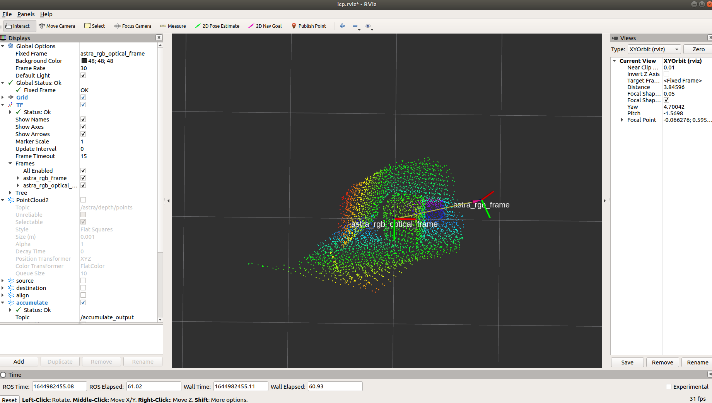
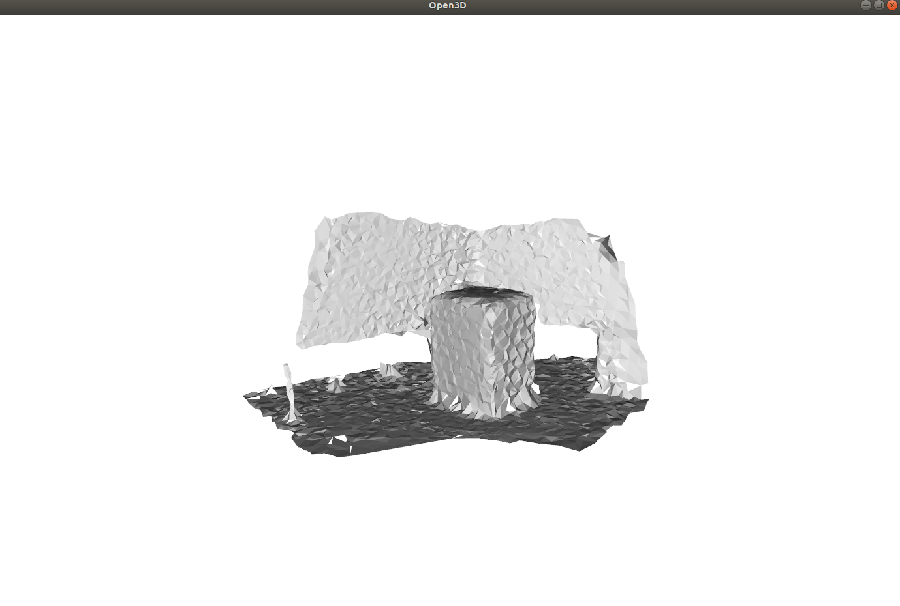

# PCL ICP & Open3D Mesh Tutorial
## **About this package**
### This package was tested in the environment below.
- Ubuntu 18.04
- ROS Melodic
- Orbbec AstraPro Camera
## **ROS Package Installation**
```bash
mkdir -p icp_ws/src
cd icp_ws/src
git clone https://github.com/woawo1213/ros_icp_tutorial.git
cd ..
catkin_make
source devel/setup.bash
```
## **Download bag file & put /bag diretory**
- <https://drive.google.com/file/d/1QtkBWLSirPc6RFXU5T-VS47cFbKiBzBU/view?usp=sharing>

## ICP 대상


## Start ICP
```bash
roslaunch icp_tutorial gicp_bag.launch
```
- 초당 1개의 샘플을 추출하여 15초간 icp 진행
- 아래 그림은 icp 결과




## Start Open3D
- script/3dmesh.ipynb 실행
- 아래 그림은 3d mesh 결과


